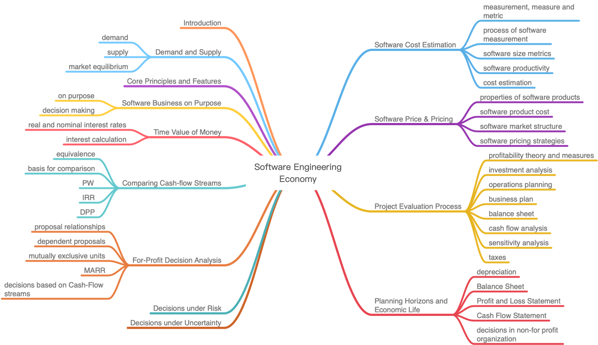

# Software Engineering Economy

* [Body of Knowledge](#body-of-knowledge)
* [Project Structure](#project-structure)
* [Table of Content](#table-of-content)
* [About the Author](#about-the-author)

------

## Body of Knowledge

 

## Project Structure

- `doc/`
  - [Software Engineering Economy](https://github.com/doubleZ0108/Software-Engineering-Economy/blob/master/doc/Software%20Engineering%20Economy.pdf)
- `pre/`
  - [presentation](https://github.com/doubleZ0108/Software-Engineering-Economy/blob/master/pre/presentation.pdf)
  - [script](https://github.com/doubleZ0108/Software-Engineering-Economy/blob/master/pre/script.pdf)
- `partition/`

 

## Table of Content

1. [Company Overview](https://github.com/doubleZ0108/Software-Engineering-Economy/blob/master/partition/Compony%20Overview/Compony%20Overview.md)
   1. Company Profile
   2. Market Analysis

      1. Feasibility Analysis
      2. Ecosystem Analysis
      3. Customer Analysis
   3. Competition Analysis
      1. Competitive Advantages
      2. Competitive Disadvantages
      3. Competition Analysis Form
   4. Assumption & Prerequisites
   5. Operation Plan
      1. Product
      2. Office Environment
      3. Personnel
      4. Sales
   6. Contract Management
2. [Budget](https://github.com/doubleZ0108/Software-Engineering-Economy/blob/master/partition/Budget/Budget.md)
   1. statement
   2. effort estimation
      1. Function points estimation
      2. Develpment effort estimation
      3. Operation and maintenance effort estimation
   3. Development cost estimation
      1. Direct labor cost estimation
      2. Direct non-labor cost estimation
      3. Indirect labor cost estimation
      4. Indirect non-labor cost estimation
      5. Total development cost estimation
   4. Operation and maintenance cost estimation
      1. Labor cost estimation (direct + indirect)
      2. Non-labor cost estimation (direct + indirect)
   5. source of budgets
   6. repayment strategies
      1. Equivalent principal
       2. Equal repayment of principal and interest (selected)
3. [Financial Evaluation](https://github.com/doubleZ0108/Software-Engineering-Economy/blob/master/partition/Financial%20Evaluation/Financial%20Evaluation.md)
   1. Pricing Strategy
      1. Factors Affecting Pricing
      2. Six Steps for Pricing Decision
      3. Determine the Final Price Strategy
   2. Cash flow
      1. Statements of Cash Flow
      2. 12 Month Cash Flow of 2020
      3. 12 Month Cash Flow of 2021
      4. 12 Month Cash Flow of 2022
      5. Project Cash Flow in 3 years
   3. Depreciation & Amortization
      1. Depreciation
      2. Amortization
   4. Profit & Loss Statement
   5. Balance Sheet
4. [Economic Evaluation](https://github.com/doubleZ0108/Software-Engineering-Economy/blob/master/partition/Economic%20Evaluation/Economic%20Evaluation.md)
   1. Break-Even analysis
   2. NPV, IRR and Paybackyear
   3. Sensitivity Analysis

 

## About the Author

| Name                            | Email                 |
| ------------------------------- | --------------------- |
| Zhe ZHANGTeam Leader | dbzdbz@tongji.edu.cn  |
| Kaixin CHEN                     | 1753188@tongji.edu.cn |
| Di BU                           | 1753414@tongji.edu.cn |

