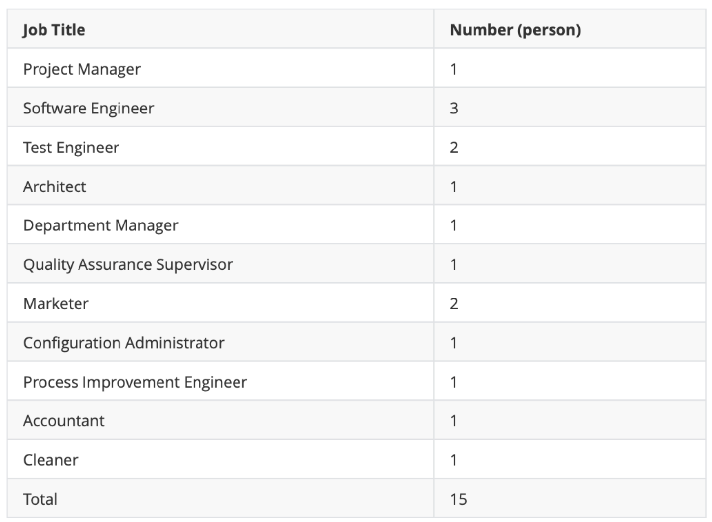
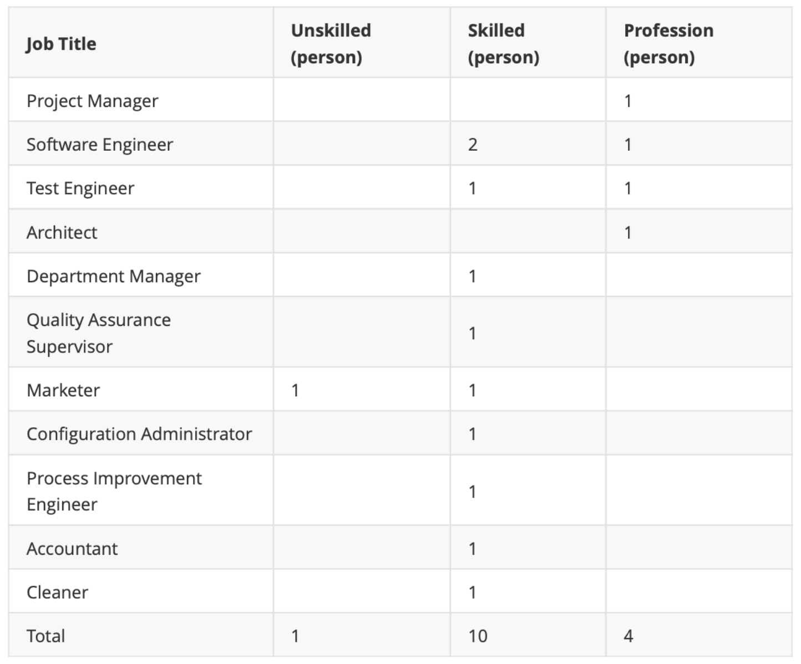
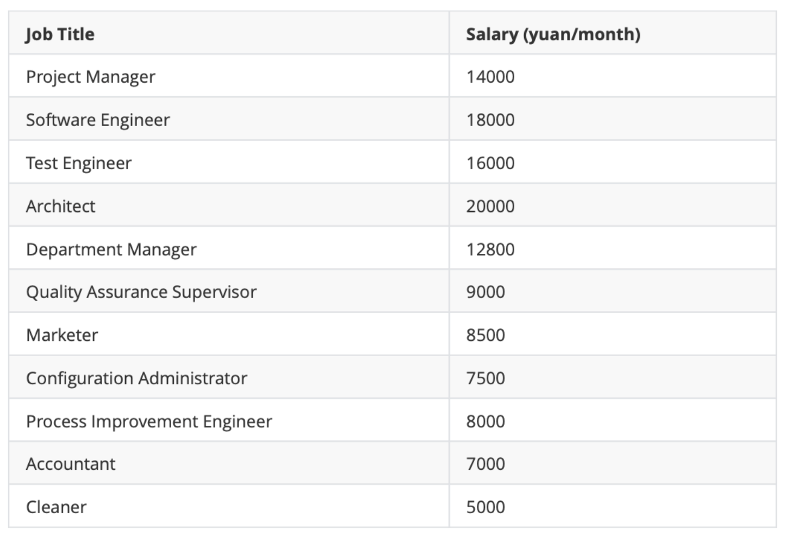
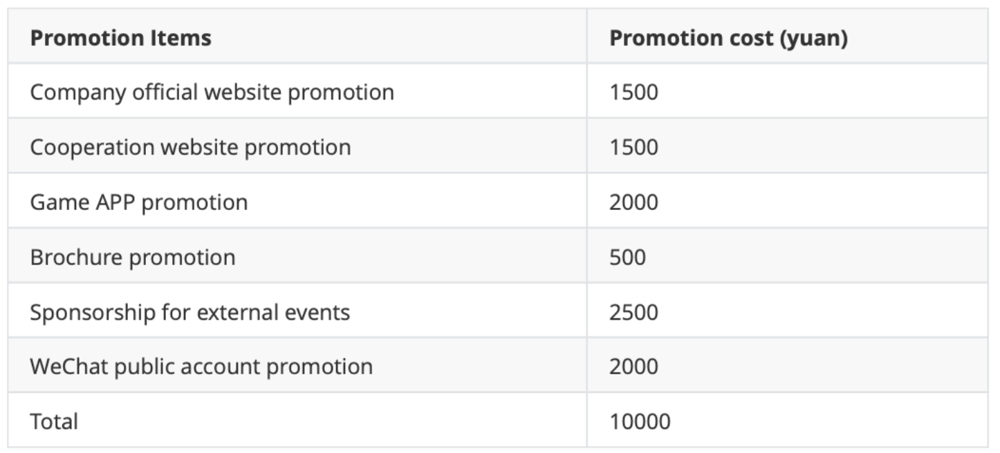

# 1. Company Overview 

##### Table of Contents

* [<strong>1.1 Company Profile</strong>](#11-company-profile)
* [<strong>1.2 Market Analysis</strong>](#12-market-analysis)
   * [<strong>1.2.1 Feasibility Analysis</strong>](#121-feasibility-analysis)
   * [<strong>1.2.2 Ecosystem Analysis</strong>](#122-ecosystem-analysis)
   * [<strong>1.2.3 Customer Analysis</strong>](#123-customer-analysis)
* [<strong>1.3 Competition Analysis</strong>](#13-competition-analysis)
   * [<strong>1.3.1 Competitive Advantages</strong>](#131-competitive-advantages)
   * [<strong>1.3.2 Competitive Disadvantage</strong>](#132-competitive-disadvantage)
   * [<strong>1.3.3 Competition Analysis Form</strong>](#133-competition-analysis-form)
* [<strong>1.4 Assumption &amp; Prerequisites</strong>](#14-assumption--prerequisites)
* [<strong>1.5 Operation Plan</strong>](#15-operation-plan)
   * [<strong>1.5.1 Product</strong>](#151-product)
      * [<strong>1.5.1.1 Production Technology</strong>](#1511-production-technology)
      * [<strong>1.5.1.2 Customer Service</strong>](#1512-customer-service)
      * [<strong>1.5.1.3 Product Development</strong>](#1513-product-development)
      * [<strong>1.5.1.4 Product Pricing</strong>](#1514-product-pricing)
   * [<strong>1.5.2 Office Environment</strong>](#152-office-environment)
   * [<strong>1.5.3 Personnel</strong>](#153-personnel)
      * [**1.5.3.1 Number and Position **](#1531-number-and-position-)
      * [<strong>1.5.3.2 Workforce Type</strong>](#1532-workforce-type)
      * [<strong>1.5.3.3 Salary Structure</strong>](#1533-salary-structure)
   * [<strong>1.5.4 Sales</strong>](#154-sales)
      * [<strong>1.5.4.1 Promotions</strong>](#1541-promotions)
      * [<strong>1.5.4.2 Promotional Budget</strong>](#1542-promotional-budget)
      * [<strong>1.5.4.3 Sales Forecast</strong>](#1543-sales-forecast)

------

## **1.1 Company Profile** 

The company's mission is to provide customers with a convenient, friendly and fast online physical game platform. The ultimate goal of the company is to be able to build a healthy, friendly and cooperative company, and to have a group of loyal customers and partners. In order to achieve our ultimate goal, game companies, etc. whose physical game resources carry out online sales business, we hope to be favored by customers in the annual customer satisfaction survey and get our suggestions for development and improvement from loyal customers 

The company's business philosophy is Q (quality), S (service), S (speed), quality is that the online physical game platform we sell must be easy to use, user-friendly, and excellent quality; service is our Customer services such as pre-sales consulting services/after-sales services/ are all quick to give feedback, attentive and thoughtful; speed lies in the response speed of our online physical game platform is good, and the feedback speed of the company's customer service is rapid. 

The online physical game platform can be regarded as a branch of the online shopping platform, but it is not the same. We can focus on meeting the preferences of customers and provide customers with a more convenient, friendly and faster online physical game system. Ability to focus on how to improve the quality of your game resources and increase your game sales. In the information age, the reality of physical game stores will be too few people because of the fast pace of life, the online physical game platform will give customers a channel to develop personal or company online sales of physical games, improve sales, and improve themselves Operating income. Therefore, the company's advantage lies in following the trend of social change, and at the same time seizing the customer's reform ideas, which can help customers increase operating income while reducing the economic burden and labor burden of operating physical game stores. 

## **1.2 Market Analysis** 

For the company's business, the underlying market is mainly the changes in the physical game market. When the physical game market changes, it will also have an impact on the business strategy of the physical game store operator, and then the operator may consider expanding or Change the operating channel, that is, turn to the understanding of the online physical game platform. 

From 2010 to 2020, the 10 years of China's physical game retail market is the 20 years that the market has developed from immature to mature. According to relevant data from the National Bureau of Statistics, the retail sales of physical games reached 71.185 billion yuan in 2018, an increase of 413.72% from 2010. In 2019, the total number of physical games in China reached 6.4 billion, an increase of 29.8% from 2010. 

### **1.2.1 Feasibility Analysis** 

1. High-quality low-price competitive advantage of online physical game stores 

Online shopping has the characteristics of low price, high efficiency, convenience, and a full range of types. Compared with the traditional physical game store business model, online physical game stores can save a lot of cost expenses such as mall rent, employee management salary, and trial loss. Obviously, this will provide a basis for the online physical game store to sell goods at a low price. The best-selling CDs, game cassettes and other products in the traditional game store can be purchased at a low price in the online physical game store. 

2. Online physical game store delivery speed is fast 

With the rapid development of the network technology and logistics industry, the e-book bookstore has a reliable space for development, which will provide buyers with great convenience, subscribe online, communicate online with the online store, try it directly in the online store, online After the store receives the purchaser's subscription information, the purchaser can immediately play the game they want. 

3. Buying customer groups faced by online physical game stores 

The current number of people on the Internet in our country will reach 80 million, most of whom are under 30 years old, and the category of college students accounts for more than 60%. In this category of user groups, I like to buy CD games, cassette games, and browse some physical games online. It is easy to accept new things, accept online shopping, and form a new trend of buying. It will form a huge target market. At the same time, the purchase of CD games and cassette games selected by the user group in this category has different levels of selection, that is, the price is low and cheap, which is the appetite for the low price sales of online physical game stores. 

Online physical game stores take advantage of the low price, high efficiency, convenience, and full range of features provided by the Internet. Buyers can directly query and select, and then directly order games online. The settlement method can be mobile phone charging, credit card settlement, mail order, wire transfer, etc. After the online physical game store confirms that the purchaser has paid, the physical game is delivered to the reader through its own delivery system.

###  **1.2.2 Ecosystem Analysis** 

The data shows that in 2015, my country's software and information technology service industry achieved 37 trillion yuan in software business revenue, a year-on-year increase of 2092%, a growth rate of 148 percentage points lower than 2015, but still higher than the electronic information manufacturing industry by about 10 percentage points. In the first half of 2016, my country's software and information technology service industry as a whole operated steadily, with software revenue growth picking up, margins increasing slightly, the central and western regions maintained rapid growth, and the scale of the central city's software industry continued to expand. In the first half of the year, my country's software and information technology service industry completed software business revenue of 20217 billion yuan, a year-on-year increase of 171%, and the growth rate was flat from January to May. Among them, the revenue from completed software business in the second quarter was 114.3 billion yuan, an increase of 30% over the first quarter. In the first half of the year, the total profit of the software and information technology service industry was 219.3 billion yuan, a year-on-year increase of 126%. The growth rate was still 94 percentage points lower than the same period last year, but an increase of 35 percentage points from the first quarter. 

According to the 2017-2023 in-depth survey analysis and development prospect research report of the Chinese software market released by the China Market Research Online. According to the report, there are currently about 1,000 new domestic software products listed each year. General software product hotspots are mainly concentrated on educational software, game software, e- book CD/multimedia software, anti-virus software, PC operating system and Chinese platform, cad/cam software. In my country, the life span of general game products is only about three months; the life span of educational software and e-book discs is about six months; the life cycle of other kinds of software is slightly longer, about one year. As technology advances and competition intensifies, the software life cycle tends to shorten. 80% of the products use CD as the carrier, and the operating environment is mostly based on windows. The purchasing power of group users is stronger than that of individual users. The purchase varieties are mainly concentrated in operating systems, databases, tool software, cad/cam software, office suites, etc., and they pay more attention to services; the consumption growth of individual users is higher than that of group users. Pay more attention to price in tools, games, education, e-books, etc. The seasonality of consumption is weak. 

### **1.2.3 Customer Analysis** 

Our customers are mainly for people who want to develop online game stores. Most of these customers have some game resources offline, want to develop online game sales business to promote sales growth, or want to operate low-cost game stores, Unable to develop offline physical game stores. The income level of these people is higher than that of ordinary people, and their education level is also relatively high. 

## **1.3 Competition Analysis** 

For the online physical game platform system, we can find many similar platforms, such as Nintendo and other game companies, and there are also many examples of developing from offline game stores to online, such as various physical game online stores in Taobao. Companies that develop online physical game systems do not open source online physical game systems, so competitors are mainly software outsourcing teams. 

### **1.3.1 Competitive Advantages** 

1. Performance characteristics

Response time: The average response time of API requests is less than 2s, and the opening speed of WEB pages is under 5s.

Online users: The system can support more than 10,000 users online at the same time. 

Throughput: The system can support 1,000 users to pay orders at the same time. 

Pressure resistance: The system can run stably for 12 hours under the condition that the operating pressure of the actual system is doubled. 

Online time: The system works 24 hours a day, 7 days a week. 

2. Performance characteristics 

1. 1. Reliability

​		Average failure time: less than 0.1% of system running time.

​		Average repair time: The average repair time of the fault is less than 3 hours. 

1. 2. Effectiveness

​		The user-friendly interface makes users feel comfortable. 

​		There are fewer errors in user understanding and operation.

​		User learning operation time is shorter.

​		In abnormal environments and situations, users can still operate normally. 

1. 3. Safety

​		User passwords and other private information use encryption algorithms. 

​		Database operations prevent injection.
 	The user login needs to enter the verification code.
 	The coupling of different modules in the system is low. 

1. 4. Maintainability

3. Other features

1. 1. The database sets different permissions for different users to ensure that you should not access things that should not be accessed. At the same time, an efficient index is established to ensure that the database query is rapid to support high concurrent access. 
   2. The system is internationalized. Temporarily supports Chinese and English. 
   3. The core business of the project, such as the following orders, payment, commodity 
       information and other modules can be reused. 
   4. The system is easy to transplant. When the whole system is in a bottleneck after a few 
       years, it can be easily transplanted and expanded. 

### **1.3.2 Competitive Disadvantage** 

Similar systems (such as Nintendo, Xbox, etc.) that have existed on the market have been developed for a long time, and a large number of sources and users have been gathered. The initial benefits of this system are low.

### **1.3.3 Competition Analysis Form** 

1=critical 5=not critical 

| **Factor**             | **This project**                       | **Software outsourcing team** | **Importance** |
| ---------------------- | -------------------------------------- | ----------------------------- | -------------- |
| Product                | Online physical game platform          | Online physical game platform | 1              |
| Price                  | Lower                                  | General                       | 3              |
| Quality                | General                                | General                       | 2              |
| Service                | Thoughtful and comprehensive           | Thoughtful                    | 3              |
| Reliability            | Relatively reliable                    | Relatively reliable           | 3              |
| Stability              | Stable                                 | Stable                        | 2              |
| Professional knowledge | Profession                             | Profession                    | 1              |
| Company reputation     | Good                                   | General                       | 3              |
| Location               | Immobilized                            | May flow                      | 2              |
| Exterior               | Friendly interface and easy operation  | Friendly interface            | 3              |
| Sales method           | Portals website                        | Outsourcing website           | 2              |
| Ad                     | Portal website and cooperation website | Outsourcing website           | 3              |

## **1.4 Assumption & Prerequisites** 

To insure that our project develops stably and the website works responsibly, we make the following assumptions. 

1. Before the development, we cost totally ¥71240 to buy necessary devices and software.
2. At the start of each month, we need to pay ¥35,000 for the rent and the miscellaneous office expenses. Suppose it will not change during the period we report
3. We use the first year to develop the website and insure it runs stably. According to our project management, we spend 3 months to develop the website and the next following 6 months we will focus on the maintenance of it.
4. We record the financial data from year1 to year4, and the staff training is only in the first 3 months of year1.
5. In the following 3 years, there will be little fluctuation in the profit and loss projection. We consider a inflation of 2.5% and make some adjustment in profit and loss. 

## **1.5 Operation Plan** 

### **1.5.1 Product**

#### **1.5.1.1 Production Technology** 

1. The overall project adopts a microservice architecture to ensure the customizability of functions and code reuse. 
2. Highly cohesive production methods, modular product components to meet the needs of customers of all levels. 
3. The front-end template can be customized, the front-end functional components are modularized and the display components are templated to achieve the ultimate development purpose. 

#### **1.5.1.2 Customer Service** 

In the business tenet of "bringing customers the most satisfactory products and services", xxx Company solemnly promises: while ensuring the advancedness, reliability, and stability of the equipment, it will continuously improve the quality of service, from sales to after-sales. Cargo, commissioning, equipment maintenance management, technical services, user technical training and other aspects to ensure that customers can get the best service, so that customers are satisfied and assured. 

1. Ensure that the system is correct, safe and the quality meets national standards, and submit it to the customer in time. 

2. Provide high-quality and fast technical services 

In order to better ensure the normal operation of the equipment, answer questions raised by users in time, and help users solve problems, the company's maintenance center and local maintenance outlets are responsible for the service of opening, maintenance, and technical consultation. Full-time engineers are responsible for the maintenance center to provide free technical consultation services to customers at any time. 

Ensure that Jiangsu, Zhejiang, Shanghai and Anhui will rush to the site within 24 hours after receiving the user's fault call, and rush to the site within 48 hours in other regions, and solve the problem within 24 hours. 

The company's maintenance center has a 24-hour telephone service, and full-time engineers accept user calls to ensure that users receive technical support in the process of using the equipment. 

Hotline: 8008208820 24 hours: 13141592126 

3. Free debugging and activation for users 

Engineers are responsible for the installation, commissioning, commissioning and testing of on-site systems. After the system is successfully debugged, the supplier shall bring the test results to the user in writing, and the supplier's technical personnel may evacuate the site only after obtaining the user's consent. 

4. Regular inspection 

Our company regards the inspection system as one of the routine maintenance tasks, that is, the company organizes the inspection of the running equipment every six months. The company mainly inspects engineering and technical personnel, and has designers involved. And listen to the problems and recommendations reflected by user maintenance personnel, and constantly improve the software and hardware functions and quality of the product. 

5. Warranty 

The warranty period of the equipment under the contract is 18 months after successful installation and commissioning. During the warranty period (except for natural disasters and man-made damage), the maintenance costs and business travel costs are borne by the supplier. 

6. Lifetime maintenance to ensure user benefits 

The company's system is guaranteed free of charge for 18 months under normal conditions (excluding natural disasters and man-made damages) from the date of opening and acceptance. Outside the warranty period, the company will provide lifetime paid service. 

7. Establish user files and improve product quality 

In addition to carrying out user technical consulting services, the company's maintenance center is also responsible for accepting and collecting user complaint and consulting information, ensuring that users' questions and requirements can be handled in a timely manner, and tracking and verifying the processing status. At the same time, establish user files to record the product usage status, and provide a basis for future product quality improvement. We will continue to strive for excellence and bring customers the most satisfactory products and services. 

8. The company's spare parts library can bring users 15 years of use and bring spare parts at the best price. 

#### **1.5.1.3 Product Development** 

1. Back-end services are assembled strictly in accordance with modularization to improve code reuse rate and reduce code error rate. 
2. The front-end functional components are highly modular, and the non-functional display components provide users with customized services to meet the needs of various types of users. 

#### **1.5.1.4 Product Pricing** 

1. Pricing method:

Based on the product's high reusability and module customization, and a certain market share brought by the company's customized services, we decided 

The target profit pricing method is adopted to price the products based on the company's annual estimated total cost and expected profit rate. 

2. Data collection:

1. 1. Based on R&D costs, operating costs, and interest on overdue loans, the expected total cost for 2 years is: 5935580 yuan 
   2. Software development VAT rate is 3% of sales 
   3. See sales forecast for expected sales 
   4. Expected profit rate is 10% of total operating expenses for 2 years 

3. Pricing calculation:

$$
2\text{YearSales} = (2\text{YearsExpectedCost}+2\text{YearsSales}*0.03)*1.1
$$

Calculated 2-year projected sales are: 6751952 yuan

Based on the expected sales volume, the 2-year sales volume is predicted to be 100 

That is, the product is priced at 68,000 yuan 

### **1.5.2 Office Environment** 

Location: Hongqiao Vanke Center, Lane 988, Shenchang Road, Changning District, Shanghai 

Area: 90m2, can accommodate 15-24 seats 

Property: Hongqiao Vanke Center 

Transportation: Metro Line 17 Hongqiao Railway Station 702 meters, Line 2 Hongqiao Railway Station 758 meters, Line 10 Main Line Hongqiao Railway Station 758 meters 

Building area: 123000m2 

### **1.5.3 Personnel**

#### **1.5.3.1 Number and Position **

#### **1.5.3.2 Workforce Type** 

#### **1.5.3.3 Salary Structure** 

### **1.5.4 Sales** 

#### **1.5.4.1 Promotions** 

The promotion activities adopted for the online book shopping platform developed by the company mainly include two types. The daily promotion includes the company's official website promotion, cooperation website promotion, brochure promotion, periodic promotion includes game APP promotion, WeChat public account promotion, external activities sponsor; 

Among them, the promotion of game APPs is promoted in a traffic game APP every month, depending on whether the promotion effect needs to choose another game APP, WeChat public account promotion chooses WeChat public account related to game recommendation for article promotion, and external event sponsorship to The frequency of twice a month selects sponsorship for game-related activities such as campus game festivals. 

#### **1.5.4.2 Promotional Budget**  

#### **1.5.4.3 Sales Forecast** 

Through the sales of related systems on outsourcing websites, combined with the actual situation of our online physical game platform, we price the online physical game system at 68,000 yuan/set; the system will be developed from scratch in the first two months of the company As a result, there is no sales volume. With the development and technological progress, and the promotion of promotion, the third month to the fifth month are expected to be able to sell three online physical game systems every month, the sixth month By the ninth month, it is expected to be able to sell four online physical game systems each month, and then gradually stabilize on the baseline of five systems sold per month. 