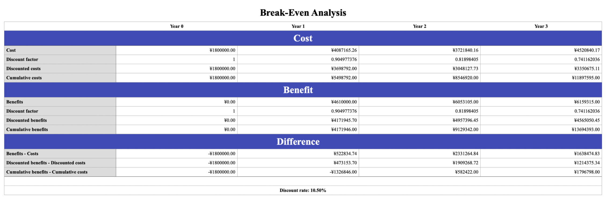
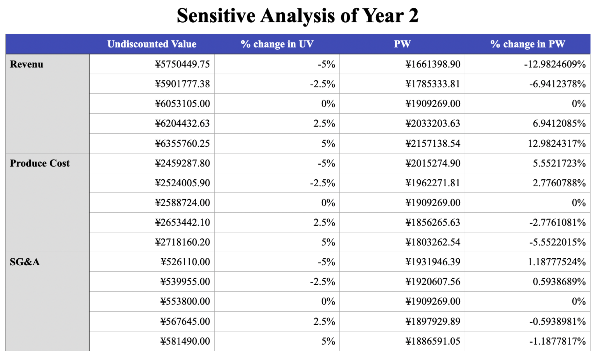

# 4. Economic Evaluation

##### Table of Contents

* [4.1 Break-Even Analysis](#41-break-even-analysis)
* [4.3 Sensitivity Analysis](#43-sensitivity-analysis)

## 4.1 Break-Even Analysis

##4.2 NPV, IRR and Paybackyear

According to the result of break-even analysis, we can calculate NPV, IRR and Payback-year now and the result of calculation is shown as below:

**Conclusion:**

It can be shown from the table that the NPV is greater than 0, indicating that the project is worthwhile to be invest. Also, you can see that the cumulative net cash flow is <0 for the first year and >0 for the second year, so the payback year is in the second year. Finally, the calculated IRR is 73% which is very bigger than the discount rate of 10.5%, indicating that the project is profitable.

## 4.3 Sensitivity Analysis

Because we will reach the breakeven point at the second year, we selected it to do sensitivity analysis which is based on its cash inflow and outflow. From all these factors concerning about the cash flow, we chose two of them: the revenu(influenced by both prices and sale volumes) and the produce costs .

Then we got a table to illustrate the sensitivity of these factors shown as below:

As we can see, just as we expected, we the sales of products increase, the present value will also increase, and vice versa. But in contrast, when the costs increase, the present value will decrease.

Then we pay more attention to their sensitivities. We find that profitability can affect the present value to the greatest extent, and the impact of spending on the present value is smaller. Overall, our projects are generally less sensitive, showing a certain degree of stability while fluctuating costs and profits. In comparison, it is more sensitive to our earnings, which means that we should focus on our pricing plans and revenue to ensure that we understand market changes.