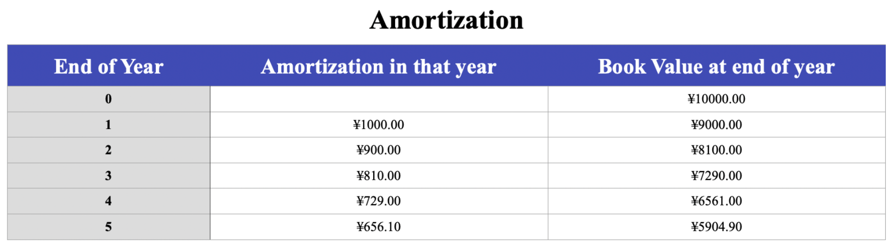

# Financial Evaluation

##### Table of Contents

* [Pricing Strategy](#pricing-strategy)
   * [Factors Affecting Pricing](#factors-affecting-pricing)
   * [Six Steps For Pricing Decision](#six-steps-for-pricing-decision)
   * [Determine the Final Price Strategy](#determine-the-final-price-strategy)
* [Cash Flow](#cash-flow)
   * [Statements of Cash Flow](#statements-of-cash-flow)
   * [12 Month Cash Flow of 2020](#12-month-cash-flow-of-2020)
   * [12 Month Cash Flow of 2021](#12-month-cash-flow-of-2021)
   * [12 Month Cash Flow of 2022](#12-month-cash-flow-of-2022)
   * [Project Cash Flow in 3 years](#project-cash-flow-in-3-years)
* [Depreciation &amp; Amortization](#depreciation--amortization)
   * [Depreciation](#depreciation)
   * [Amortization](#amortization)
* [Profit &amp; Loss Statement](#profit--loss-statement)
* [Balance Sheet](#balance-sheet)

## Pricing Strategy

Business may benefit from lowering or raising prices, depending on the needs and behaviors of customers and clients in the particular market. Finding the right pricing stragety is an important element in running a successful business. So at the beginning of financial evaluation of our ICE project, we concrete on the pricing strategy.

### Factors Affecting Pricing

According to the *SEE.ch09.lecture 8^th^ PPT of Prof. Huang*, there are 8 essential factors that are supposed to be taken into consideration, they are showing as follow:

### Six Steps For Pricing Decision

And after compare the 5 main pricing strategies of software which are Personalized Pricing, Group Pricing, Versioning Pricing, Budling Pricing, Usage-based Pricing. We make a 7 steps procedure for determine the pricing strategy

1. **Organization and market objectives**

   1. a more convenient online entity game trading environment
   2. a more direct interactive platform for game publisher and game buyer and lovers
   3. a more convenient way for entity game lover compare to online game and other electronic game

2. **Determining the pricing objective**

   - survial
   - maximum current profit
   - maximum market share
   - quickly occupy the direct sales liceses of large entity game publishers

3. **Considering the demand**

   - elasticity
   - the relationship between price and demand
   - the sensitivity for demand to price
   - adjust business strategy in real time

4. **Estimating the cost in 4 aspests mentioned in The National Standard**

   - direct labor costs 
   - direct non-labor costs
   -  indirect labor costs
   -  indirect non-labor costs

5. **Analysis competitor's price strategy**

   - competitor's costs
   - competitor's prices
   - competitor's market share compare to me
   - competitor's market share to the whole market
   - competitors products

6. **Legal and regulatory issues**

   According to the relevent regulations of the Chinese government, we must supervise the types of entity games on sale, which may also bring costs for labors.

### Determine the Final Price Strategy

1. **Selecting the final pricing method**

   There are 6 method of pricing we can choose

   - Mark up pricing 
   - Target - return pricing
   - Perceived - value pricing 
   - Value - pricing
   - Going - rate pricing
   - Sealed - bird pricing

   After considering the pricing objects and the determine demand, we chose the **Mark-up pricing** finally
   $$
   Price = Cost + Profit \ Margin
   $$
   Also we take **Bundling pricing** into combination, this means we open up different interfaces for customers which is similar to Prime users on Amazon. And with different payment strategies or policies, they can enjoy different services including ideal products recommendation, more convenient shopping experience, less uncorrelated ads, multiple themes and patterns and so on...

2. Setting the price by using **3 Cs Strategic Triangle Model**

   

   **For entity games publishers**:

   - Firstly, the entity game publishers who want to use our platform should pay ¥5,000 for their credits and the guarantee of their record in the ministry of industry and information technology annually.
   - By considering competitor's prices and profit margins, we determined our final profit as 20%. This mean we want to gain 20% of the cost we spend from the entity games publishers.

   **For entity games customers**: 

   - According to our developing cost ¥388,454 and maintenance cost ¥76723 monthly, we finally make 4 kinds of services for entity games publishers to choose, they are:
     - Service A: 50% common customers. ¥10,000 per year (basic)
     - Service B: 30% customers and a slightly lower promotion effort than Service A. ¥30,000 per year. (middle)
     - Service C: 20% customers, promotion by our website and their entity games can be chosen firstly. ¥50,000 per year (prime)

------

## Cash Flow

### Statements of Cash Flow

Before we use the techniques we learnt from the course based on Prof Huang's lecture, we make some statements on our cash flow: 

2. Each cash flow is calculated at the end of the year.

3. For the 12 month cash flow from 2020 to 2022, we definite one season as one software development cycle.

4. For the 3 year cash flow, estimate costs and sales are based on the data of the first year.

4. The first four months are development months, and the other is maintenance months.

5. Sales of our ICE online Entity Game increase every year and with a normal rate. This is mean the number of publisher, number of normal customer, number of prime customer will increase with a normal rate(also we take a slight random distribution into consideration).

6. Rent costs, miscellaneout increase with currency inflation.

7. According to the national policies on software industry, at the first two year, we needn’t to pay any tax. The tax rate of year 3 is 12.5%.

8. Basic formula for cash flow caluation we use is:
   $$
   \text{CashFlow}_t = \text{TotalInflow}_t - \text{TotalOutflow}_t + \text{CashFlow}_{t-1}
   $$

9. The salary of our team members increases with a 10% rate per year.

According to these 9 statements we mentioned above, we make the cash flow of the first three years of our company and also we make a global cash flow for all of the three years. 

First, we divide the cash flow into 2 aspects. 

- cash flow inflows
- cash flow outflow

As for the total pruduct sales, we divide it into 3 parts which is mentioned in the **PartII: 2.2.2 Development Effort Estimation**. As for development costs and operating costs, we divide the development costs into labor costs and non-labor costs which is mentioned in the **PartII: 2.2.3 Operation and Maintenance Effort Estimation**.

And after that, we transform our point of view into another aspect, in which we divide the cash flow table into 3 parts:

- Operating cash flow
- Investing cash flow
- Financing cash flow

We transform total product sales which come from the cash flow inflows above, and we expand the non-labor costs into 10 parts(office expenses, travel expenses, staff training, service expenses, equipment and software purchase, rent, utilities, equipment maintenance fee, property costs, daily office expenses). Also we expand the investment into investing inflows and investing outflows consist of several subjects. Thirdly we combine start-up capital, loan and other related financing into the the financing cash flow.

From the second form of cash flow table we can get the details of cash flow more visually and we can also understand the significant of cash flow more meaningful.

### 12 Month Cash Flow of 2020

According to the statements listing above. The cash flow of the first year(2020) is shown as below:

### 12 Month Cash Flow of 2021

According to the statements listing above. The cash flow of the second year(2021) is shown as below:

### 12 Month Cash Flow of 2022

According to the statements listing above. The cash flow of the third year(2022) is shown as below:

### Project Cash Flow in 3 years

Finally, the following table is the 3-year cash flow chart. We assume that the revenue from selling services for entity game publishers and entity game customers rises at a reasonable rate. At the same time, miscellaneous fees and rents are also rising accordingly due to inflation. And also we draw a 3-year cash flow trend which shows that the overall company's cash flow rising in the last column of the project cash flow in 3 years.

From the cash flow of these three years, there are something deversed to mention:

- For operating cash flows: Inflows of operating flow are mainly came from sales of good which is a circle in every season. For operating outflows, at the beginning of the project, we spent ¥388454 for development costs monthly sustain for 4 months. And ¥195154 for operating costs monthly from the 5th month to the end. Personal cost is stable every month within one year. Miscellaneous expenses and rent is the same in each month.
- For investing cash flows:  We have no plan on any investment since we are a start-up company and we don't have revelent skills in this area currently in the first year. And as for the last two years, we spent some money for buying of investment products(such as bounds).
- For financing cash flow:  We have ¥800000 by investment and ¥1000000 from loan in the first month in 2020. And we should also pay taxes according to laws and regulations.

From the figure, we can see that our profit keeps increasing in this 3 years.

------

## Depreciation & Amortization

To develop our ICE online entity game website, we spent totally ¥40,000 on hardware(devices) and ¥10,000 on the software, so we have to discuss about their depreciation and amortization when calculating the profit.

### Depreciation

Depreciation are not cash-flow instances actually, it refers to the decline in the value of fixed assets. Depreciation is assessed according to the established method.

We use the **Declining Balance Depreciation method** as mentioned in the lecture of Prof. Huang's lecture. The formulas are shown as follows:
$$
\text{Depreciation}_{year(t)} = \alpha * \text{BookValue}_{year(t-1)} \\
\text{BookValue}_{year(t)} = \text{AcquisionCost} * (1-\alpha)^t
$$
As for our research, the depreciation period of electronic hardware and other devices are usally 4~10 years. The residual value is 5% of the initial value. So we set $\alpha$ as 0.33 and the results is shown as follow:

### Amortization

The software we purchased at the beginning of the development should be managed as intagible assets. They are in accordance with the annual cost of their use and similar to the depreciation of fixed assets, and they should be amortized.

We use **Straight-line method of amortization** to calculate the amortization. The formula are shown as follows:
$$
\text{Amortization} = \frac{(\text{AcquisitionCost} - \text{SalvageValue})}{\text{Lifespan}} \\
\text{BookValue}_{year(t)} = \text{AcquisionCost} - (t * \text{Amortization})
$$
According to the relevane provision of the government, we choose 5 years as the amortization since the software we purchased doesn't have a defined benefit period. The result is shown as follow:

------

## Profit & Loss Statement

**Statements**

1. According to the national policies, we needn’t to pay any tax in first two years, and we should pay 12.5% of VAT in the third year.
2. Depreciation and miscellaneous are decreasing in each year and amortization is flatted through these years.
3. We pay the salary to the team members monthly.
4. We repay the loan in the first 3 yers, so the the interest rate rate becomes 0 at the end of the 3rd year.
5. From the total net income, we can see that the net income is increasing with increase of year.

------

## Balance Sheet

Because the balance sheet is based on accuracy data, we are supposed to choose a specific point in time for analysis. In the following calculating we choose December 31th of each year for checkpoint to calculate the balance sheet.

In intangible assets, we have to think about intellectual assets. Here, we have searched for information about intellectual assets. This is because the value of knowledge assets is difficult to measure, so there is no need to consider amortization.

In the balance sheet:

- Cash Equivalent is the Cumulative Cash Flow in the 3-year cash flow table, which can be understood as the money in hand at this point of time.
- Wage Payable is the salary to be paid in December.
- Interest is the remaining unpaid Interest.
- Tax Payable
- Dividends Payable is the dividend in this year, likewise, we will pay for dividends at the end of the year(after the first year)

The formula in the textbook
$$
\text{Total Assets} = \text{Total Liabilities} + \text{Total Owner's Equity}
$$

