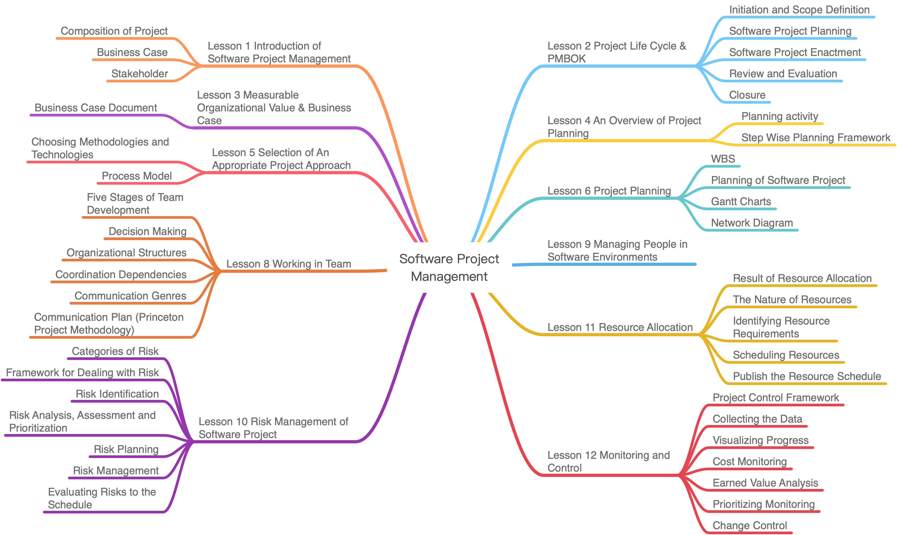

# Software Project and Process Management

* [Body of Knowledge](#body-of-knowledge)
* [Project Structure](#project-structure)
* [Partitions](#partitions)
* [About the Author](#about-the-author)

------

## Body of Knowledge

 

## Project Structure

- `doc/`
  - [Software Project and Process Management Course Project Design](https://github.com/doubleZ0108/Software-Project-and-Process-Management/blob/master/doc/Software%20Project%20and%20Process%20Management%20Course%20Project%20Design.pdf)
  - [Business Case](https://github.com/doubleZ0108/Software-Project-and-Process-Management/blob/master/doc/Business%20Case.pdf)
  - [Project Charter](https://github.com/doubleZ0108/Software-Project-and-Process-Management/blob/master/doc/Project%20Charter.pdf)
- `pre/`
  - [presentation](https://github.com/doubleZ0108/Software-Project-and-Process-Management/blob/master/pre/presentation.pdf)
  - [script](https://github.com/doubleZ0108/Software-Project-and-Process-Management/blob/master/pre/script.pdf)
- `partition/`

 

## Partitions

1. [General View](https://github.com/doubleZ0108/Software-Project-and-Process-Management/blob/master/partition/General%20View/General%20View.md)
   1. Background
   2. Vision
   3. Requirements
   4. Assumptions
2. [Initation and Scope Definition](https://github.com/doubleZ0108/Software-Project-and-Process-Management/blob/master/partition/Initiation%20and%20Scope%20Definition/Initiation-and-Scope-Definition.md)
   1. Requirement Management
      1. Determination and Negotiation
      2. Review and Revision
   2. Feasibility Analysis
      1. Functions
      2. Constraints
      3. Features
   3. Scope
3. [Planning Management](https://github.com/doubleZ0108/Software-Project-and-Process-Management/blob/master/partition/Planning%20Management/Planning-Management.md)
   1. Planning Activities
   2. Project Organization
      1. Team Structure
      2. Roles, Responsibilities and Authorities
      3. Communication Style
   3. Software Project Planning
      1. WBS
      2. Network Plan & Critical Path
4. [Risk Management](https://github.com/doubleZ0108/Software-Project-and-Process-Management/blob/master/partition/Risk%20Management/Risk-Management.md)
   1. Risk Management Plan
   2. Categories of Risk
   3. Risk Identification
   4. Risk Analysis, Assessment and Prioritization
   5. Risk Prevention
   6. Risk Action
   7. Risk Evaluation
      1. PERT Activities Schedule
      2. Project Cycle Activities Network Diagram
5. [Resource Allocation](https://github.com/doubleZ0108/Software-Project-and-Process-Management/blob/master/partition/Resource%20Allocation/Resource-Allocation.md)
   1. Identifying Resource Requirements
   2. Scheduling Resources
6. [Monitor & Control](https://github.com/doubleZ0108/Software-Project-and-Process-Management/blob/master/partition/Monitor%20%26%20Control/Monitor_and_Control.md)
   1. Project Control Framework
   2. Data Collection
   3. Progress Visualization
   4. Cost Monitoring
   5. Earned Value Analysis
   6. Change Control
7. Project Implementation
   1. Process Model
   2. Development Techniques
8. Prototype
9. References

Appidx 1 [Business Case](https://github.com/doubleZ0108/Software-Project-and-Process-Management/blob/master/partition/Business%20Case/Business%20Case%20for%20the%20%22Online%20Entity%20Game%20Store%20——%20ICE%22%20Project.md)

Appidx 2 [Project Charter](https://github.com/doubleZ0108/Software-Project-and-Process-Management/blob/master/partition/Project%20Charter/Project%20Charter.md)

Appidx 3 [General View for Project](https://github.com/doubleZ0108/Software-Project-and-Process-Management/blob/master/partition/General%20View/General%20View%20for%20the%20"Online%20Entity%20Game%20Store%20——%20ICE"%20Project.md)

 

## About the Author

| Name                            | Email                 |
| ------------------------------- | --------------------- |
| Zhe ZHANGTeam Leader | dbzdbz@tongji.edu.cn  |
| Kaixin CHEN                     | 1753188@tongji.edu.cn |
| Di BU                           | 1753414@tongji.edu.cn |

