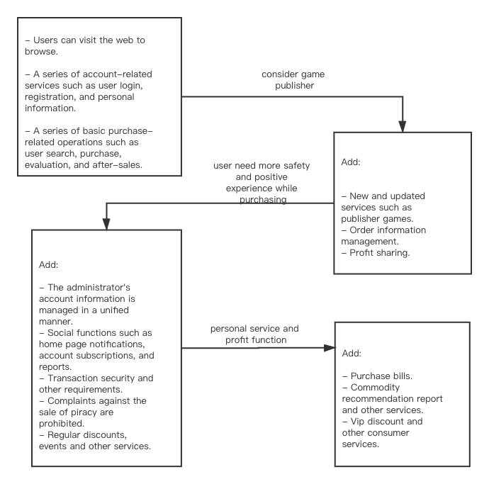

# 2. Initation and Scope Definition

##### Table of Contents

* [2.1 Requirement Management](#21-requirement-management)
   * [2.1.1 Determination and Negotiation](#211-determination-and-negotiation)
   * [2.1.2 Review and Revision](#212-review-and-revision)
* [2.2 Feasibility Analysis](#22-feasibility-analysis)
   * [2.2.1 Functions](#221-functions)
   * [2.2.2 Constraints](#222-constraints)
   * [2.2.3 Features](#223-features)
* [2.3 Scope](#23-scope)

------

## 2.1 Requirement Management

### 2.1.1 Determination and Negotiation

With the development of platforms such as Steam and GOG, today, digital games seem to have become the first choice for computer gamers. However, players of other gaming machines still tend to purchase physical games for collection or other purposes, and as more and more players purchase gaming machines, this market is still booming.

In such a large environment, we decided to create a sales platform specifically for the market, let major game manufacturers sell their products on the platform, users can purchase, evaluate, communicate and other activities on this platform Consultation and game purchase experience.

Therefore, customers must go through the website to access the game store and manage the company. Users can access it via PC or mobile device. The system must allow the customer to search his or her favorite game in our system and add the game to the shopping cart or wish list. The system must provide a platform for publishers to add new games, manage game-related information, and easily manage orders.

### 2.1.2 Review and Revision

Here are the revolution of our requirements.

## 2.2 Feasibility Analysis

### 2.2.1 Functions

- Functions for users
  - The user logs in to ICE.
  - The user searches for games in ICE.
  - The user views game categories in ICE.
  - The user views game consoles in ICE.
  - The user views game publishers in ICE.
  - The user views personal homepage in ICE.
  - The user views order information in ICE.
  - The user views shopping cart information in ICE.
  - The user views game details information in ICE.
  - The user purchases game in ICE.
  - The user adds the game to the shopping cart in ICE.
  - The user adds the game to the wish list in ICE.
  - The user modifies personal information in ICE.
  - The user adds delivery address in ICE.
  - The user rates the order in ICE.
- Functions for publishers
  - The publisher logs in to ICE.
  - The publisher views personal information in ICE.
  - The publisher modifies personal information in ICE.
  - The publisher views game list in ICE.
  - The publisher modifies game information in ICE.
  - The publisher removes game in ICE.
  - The publisher adds game in ICE.
  - The publisher views order in ICE.
  - The publisher modifies the order information in ICE.
  - The publisher delivery the game product in ICE.
- Functions for administrators
  - The administrator logs in to ICE.
  - The administrator exits from ICE.
  - The administrator makes announcement in ICE.
  - The administrator manages users' account in ICE.
  - The administrator checks users' comments in ICE.
  - The administrator handles with report informations in ICE.
  - The administrator makes recommend information in ICE.
- Functions for analysts
  - Which entity games are better sold in the second quarter than the first quarter?
  - Which categories of entity games are the most profitable ones?
  - What is the average time between the order placed and shipped?
  - Is there any significant difference between entity games published by different publishers in terms of profitability?
  - Basic "Gamers Persona" for customers visit our website.

### 2.2.2 Constraints

- Customers would pay by credit card, Alipay, or WeChat. All transactions should be secured.
- Access to the system will be available through a web site via PC, mobile devices etc.
- User (Customers) can discuss any games, but ICE only provides entity games from different game companies for gamers owning different gaming consoles.

### 2.2.3 Features

1. Performance requirements:
   - In 95% of the cases, the response time in the general period does not exceed 1.5 seconds, and the peak period does not exceed 4 seconds.
   - Searching according to the specific conditions of number and name during non-peak hours, you can get the search results within 3 seconds.
   - The final estimated number of users is 10,000, the number of daily logged-in users is about 3,000, and the network bandwidth is 100M bandwidth.
   - The system can satisfy 5,000 user requests at the same time and provide browsing functions for 10,000 concurrent users.
2. Security requirements:
   - Strict permission access control, after identity authentication, users can only access data within their permission range and can only perform operations within their permission range.
   - Different users have different identities and permissions. It is necessary to provide trusted authorization management services under the premise that the user's identity is true and trustworthy, to protect data from illegal / unauthorized access and tampering, and to ensure data confidentiality and integrity.
   - Can withstand general malicious attacks from the Internet. Such as virus (including Trojan horse) attacks, password guessing attacks, hacking, etc.
3. Reliability requirements:
   - There are prompts for input and data are checked to prevent abnormal data.
   - The system is robust and should be able to deal with all kinds of abnormal conditions that occur during the operation of the system, such as: human operation errors, illegal data input, and hardware device failure. The system should be able to handle it properly and avoid it properly.
4. Data confidentiality requirements:
   - Network transmission data should be encrypted. It is necessary to ensure that the data is not peeped, stolen, or tampered with during the collection, transmission, and processing. Business data needs to be encrypted during storage to ensure that it cannot be cracked.
5. Ease of use requirements:
   - 60% of users can master the use and purchase methods through the experience of other platforms and the description of the platform within 5 seconds of first seeing the platform.
6. Maintainability requirements
   - After receiving the modification request, the ordinary modification should be completed within 1 to 2 days; for the evaluation of the major demand or design modification should be completed within 1 week.
   - 90% of the bugs were modified within 1 working day, and others within 2 working days.

## 2.3 Scope

ICE's strategic goals include continuous growth and profitability, as well as increasing awareness and building a platform atmosphere. This project is based on the entity game market. It hopes to attract users' favor with comprehensive and exquisite games, and optimize the work of managers with concise and refined operation methods. It will improve customer performance with excellent early warning and feedback, and gradually create a user online purchase entity games is the preferred platform and provides long-term and stable services for our buyers and partners. In order to achieve this goal, it is necessary to ensure sufficient game sources, and a certain amount of overhead is allowed in the early stage to increase the popularity of the platform and the complete game purchase experience.

Specific and direct goals are:

1. Meet business needs. ICE must be able to complete the purchase service provided to users, and provide administrators with basic business functions such as income and expenditure inventory reports.
2. Improve work efficiency. ICE needs to respond to some preset scenarios and optimize the management of administrators to improve work efficiency.
3. Improve profitability. ICE needs to complete the summary of sales reports, inventory information, etc., so that administrators can adjust business strategies in time to obtain greater profits.
4. Enhance corporate brand. ICE is committed to improving the buying experience of buyers, enhancing the visibility of the platform, strengthening the construction of atmosphere, and improving profitability from the side.

