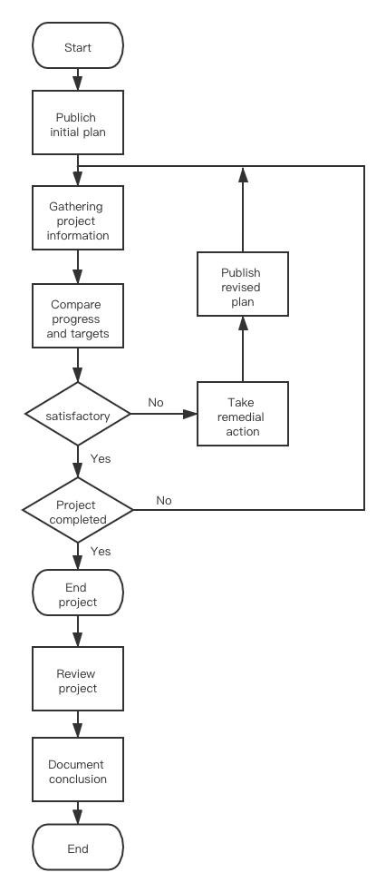
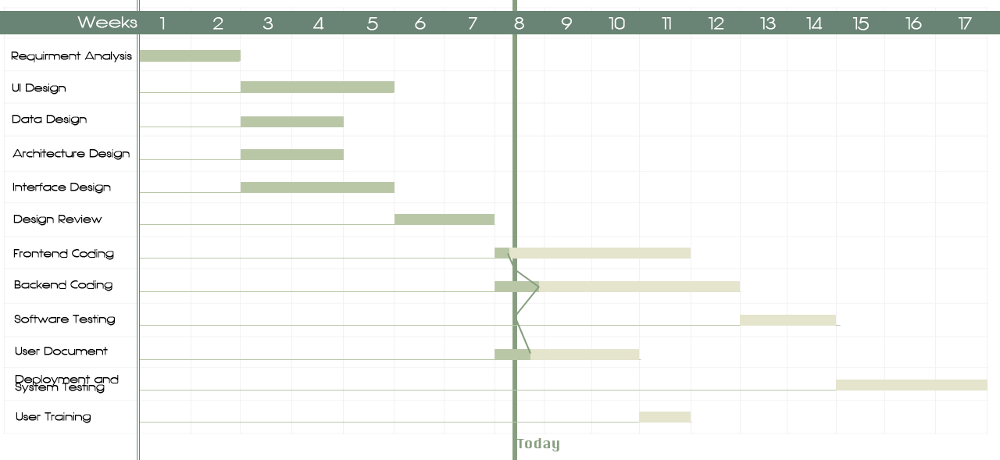

# Monitor & Control

##### Table of Contents

* [6.1 Project control framework](#61-project-control-framework)
* [6.2 Data Collection](#62-data-collection)
* [6.3 Progress Visualization](#63-progress-visualization)
* [6.4 Cost Monitoring](#64-cost-monitoring)
* [6.5 Earned Value Analysis](#65-earned-value-analysis)
* [6.6 Proprotizing Monitoring](#66-proprotizing-monitoring)
* [6.7 Change Control](#67-change-control)

------

## 6.1 Project control framework

We monitor the progress of the project, compare the difference between the actual progress and the plan, we modify the plan so that the project can return to the desired track. The product manager in charge of the business pays attention to the progress of the project every day, and the project manager conducts a weekly project report. Ask team members who work harder to be effective, or allocate additional resources to tune resources on non-critical paths to critical paths. Of course, other members in the team also need to give their reports in different ways and frequencies.

## 6.2 Data Collection

Every one should gather the tasks which are partially completed. In the process of collecting data, there are two methods: **partial completion report** and **risk report**. Considering that the partial completion of the report will make employees less focused and may cause delays, the task of making the partial completion report is left to the product manager for production and analysis. Each employee confirms the risk report weekly.

The two reports are as follows. Because there is no actual process reference, the textbook has been appropriately modified to the sample report.

## 6.3 Progress Visualization

The project manager can modify the **Gantt chart** when a activity is completed, and the visualization of it should given to all the member.

Someone prefer **slip chart**. A slup char is a very similiar alternative fovoured by some project manager, who believe it prodies a more striking visual indication of those activities that are not progressing toschedual. The two chart are both a simple example of project.

## 6.4 Cost Monitoring

Expenditure monitoring is an important component of project control, it provides an indication of the effort that has gone into our ICE project. Our ICE project might be on time but only because more monty has been spent on activities than originally budgeted. Our **Cumulative Expenditure Chart** is shown below, which provides a simple method of comparing actual and planned expenditure. Also we need to take account of the current status of our ICE project activities before attempting to interpret the meaning of recorded expenditure.

Then we add projected future costs calculated by adding the estimated costs of uncompleted work to the costs already incurred. Where a computer-based planning tool is used, revision of cost schedules is generally provided automatically once actual expenditure has been record. We update the Cumulative Expenditure Chart and including additional information available once the revised cost schedule.

## 6.5 Earned Value Analysis

Earned Value Management measures progress against a baseline. It involves calculating three key value for each activity in the WBS.

- **Planned Value(PV)**: the portion of the approved cost estimate planned to be spent on the given activity during a giben period
- **Actual Cost(AC)**: the total of the costs incurred in accomplishing work on the activity in a given period. It must correspond to whatever was budgeted for the Planned Value and the Earned Value
- **Earned Value(EV)**: the value of the work actually completed

These three values are combined to determine at that point in time whether or not work is being accomplished as planned. The most commonly used measures are the cost variance:
$$
CV = EV - AC
$$
and the schedule variance:
$$
SV = EV - PV
$$
These two values can be converted to efficiency indicators to reflact the cost and schedule performance of the project. The most commonly used cost-efficiency indicator is the **Cost Performance Index(CPI)**. It is calculated as:
$$
CPI = \frac{EV}{AC}
$$
The sum of all individual EV budgets divided by the sum of all individual AC's is known as the cumulative CPI, and is generally used to forecast the cost to complete a project. The **Schedule Performance Index(SPI)** is often used with the CPI to forecast overall project completion estimates, and it can be calculated by:
$$
SPI = \frac{EV}{PV}
$$
A negative schedule variance(SV) calculated at a given point in time means the project is behind schedule, while a negative cost variance(CV) means the project is over budget.

We combined the **Baseline Budget** and **0/100 technique**, assigning 0 to task unfinished and 100% to task completed of the budget value

| Task                        | Budgeted workdays | Scheduled completion | Cumulative workdays | % cumulative earned value |
| --------------------------- | ----------------- | -------------------- | ------------------- | ------------------------- |
| Requirement Analysis        | 14                | 14                   | 14                  | 6.25%                     |
| Architecture Desin          | 14                | 28                   | 42                  | 18.75                     |
| Data Design                 | 14                | 28                   |                     |                           |
| User Interface Design       | 21                | 35                   | 84                  | 37.5                      |
| Interface Design            | 21                | 35                   |                     |                           |
| Design Review               | 14                | 49                   | 98                  | 43.75                     |
| User Manual                 | 21                | 70                   | 119                 | 53.125                    |
| User Training               | 7                 | 77                   | 154                 | 68.75                     |
| Front-end Implementation    | 28                | 77                   |                     |                           |
| Back-end Implementation     | 35                | 84                   | 189                 | 84.375                    |
| Software Testing            | 14                | 98                   | 203                 | 90.625                    |
| Deployment & System Testing | 21                | 119                  | 224                 | 100                       |

## 6.6 Proprotizing Monitoring

Regarding the level of supervision, we decide the level of supervision based on high-risk activities, give higher priority to high-risk activities, and then focus on critical path activities. Related detailed activities are as follows:

## 6.7 Change Control

Because that the changes including requirements changes and staff changes couldn’t be avoided in the process, so we must control and manage the changes. The change control managing process is showed in the following figure:

The key points is to plan the change beforehand, then we estimate the risk of controlling the change, and include the verification of the success, the testing must be done to the change to ensure that we can control it, at last, we assign our staff with new responsibilities to solve the problems caused by the changes.