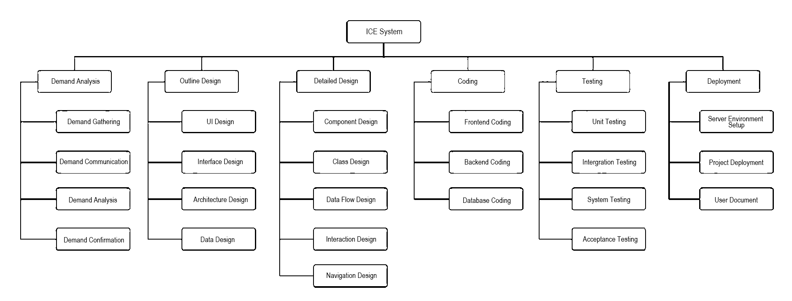
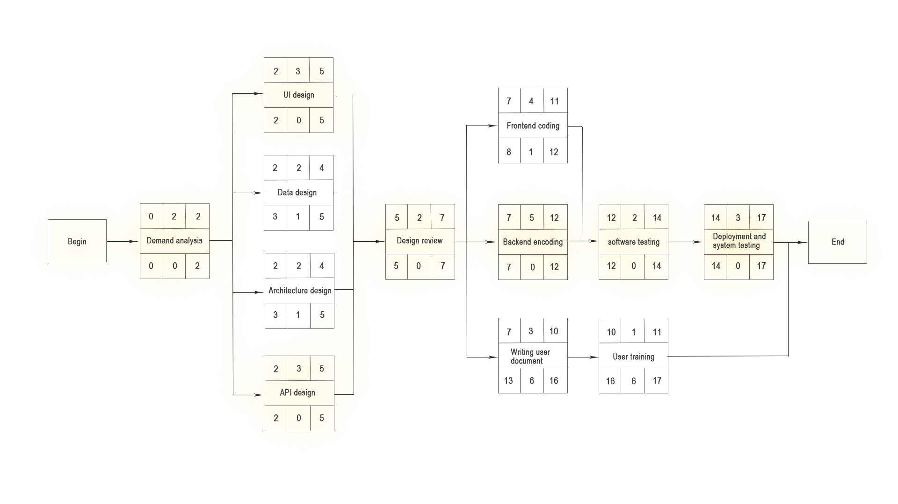
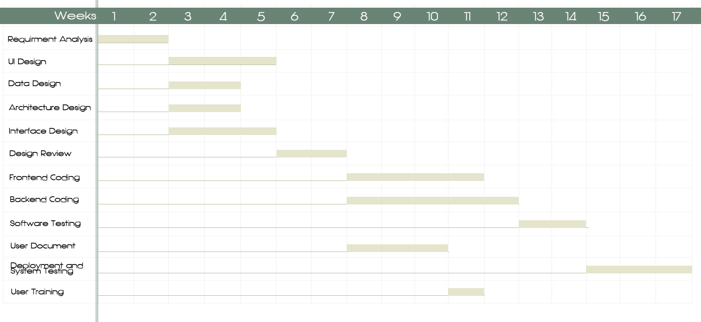

# 3. Planning Management

##### Table of Contents

* [3.1 Planning Activities](#31-planning-activities)
* [3.2 Project Organization](#32-project-organization)
   * [3.2.1 Team Structure](#321-team-structure)
   * [3.2.2 Roles, Responsibilities and Authority](#322-roles-responsibilities-and-authority)
   * [3.2.3 Communication Style](#323-communication-style)
* [3.3 Software Project Planning](#33-software-project-planning)
   * [3.3.1 WBS](#331-wbs)
   * [3.3.2 Network Plan &amp; Critical Path](#332-network-plan--critical-path)

------

## 3.1 Planning Activities

| Step                                                         | Activity                                                     |
| ------------------------------------------------------------ | ------------------------------------------------------------ |
| 0 : Select project                                           | ICE : an entity game platform                                |
| 1 : Identify project scope and objectives     1.1 Identify objectives and measures of effectiveness     1.2 Establish authority     1.3 Identify stakeholders     1.4 Modify objectives in the light of skate holder analysis     1.5 Estblish methods of communication | - 1.1: [Objectview](#2.3.1-objectview) - 1.2: The project authority is controlled by the project steering committee, and is particularly responsible for setting, monitoring and revising the goals. At present, this work is performed by three people in our group. - 1.3: Skateholders: Project staff; people outside the project in the same organization, like communication personnel; persons outside the organization game purchasers, game manufacturers. - 1.4: [Review and Revision](#2.1.2-review-and-revision) - 1.5: [Communication Style](#3.2.3-communication-style) |
| 2 : Identify project infrastucture     2.1 Establish relationship between project and strategic planning     2.2 Identify installation standards and procedures     2.3 Identify project team organization | - 2.1: Need to decide in what order to execute these projects, need to establish a framework to accommodate the new system, such as hardware and software standards. - 2.2: There should be standards for change control and configuration management; there may be provisions for quality checks at every point in the project life cycle; there should also be a measurement procedure to control the data that must be collected at each stage; the project manager should be aware of any relevant projects Planning and control standards. - 2.3: The person in charge of a large project may need to control the organizational structure of the project team. While our team has very simple [Team Structure](#3.2.1-team-structure). |
| 3 : Analyse project characteristics     3.1 Objective- or product-driven     3.2 Analyse other project characteristics     3.3 Identify high-level project risk     3.4 Take into account user requirements concerning implementation     3.5 Select general life-cycle approach     3.6 Review overall resource estimates | - 3.1: Mostly product-driven. - 3.2: [Features](#2.2.3-features) - 3.3: Assess the risk level of all projects, make [!!这里需要修改 risk prioritization]() and focus on high-risk projects - 3.4: Customers sometimes have their own regulatory requirements. Some of them in [Requirment](#1.3-requirement). - 3.5 开发方法和生命周期方法：敏捷开发（？），卜滴加一点粗略的介绍放到这里 - 3.6 [!!这里需要修改 Identifying Resource Requirements]() for all projects, and consider the project's personnel allocation and other issues |
| 4 : Identify project products and activities      4.1 Identify and describe project products     4.2 Document generic product flows     4.3 Recognize product instances     4.4 Produce ideal activity network     4.5 Modify ideal to take into account need for stages and checkpoints | - 4.1: Identifying all the items to be created by the project helps to ensure that all activities that need to be performed have been considered. Including deliverables, intermediate products, etc., including both technical products and products related to project management and quality. These products have their own hierarchical structure, which can be represented by Product Breakdown Structure. - 4.2: Determine the order in which products are created or used through the Product Flow Diagram - 4.3: When the same common PFD fragment is related to multiple instances of a particular type of product, Bian tries to identify each instance. - 4.4: The ideal activity web with sufficient resources. - 4.5: Introduce checkpoint activity to modify activity network. |
| 5 : Estimate effort for each activity     5.1 Carry out bottom-up estimates     5.2 Revise plan to create controllable activities | - 5.1: Estimate the amount of staff work required for each activity, possible time consumption, and required non-human resources with [Network Plan](#3.3.2-network-plan-&-critical-path) - 5.2: Activities that take a long time to split, activities that take a short time to merge. Set the time span of the activity to be the same as the reporting period used to monitor and control the project.  |
| 6 : Identify out bottom-up estimates      6.1 Identify and quantify activity-based risks     6.2 Plan risk reduction and contingency measures where appropriate      6.3 Adjust plans and estimates to take account of risks | - 6.1: Review each activity and estimate their risk of success. - 6.2: Some identified risks can be avoided or at least reduced. If there is a risk, the emergency plan specifies the actions to be taken. - 6.3: May change the plan, or add some new activities to reduce risk. |
| 7 : Allocate resources     7.1 Identify and allocate resources     7.2 Revise plans and estimates to take account of resource constraints | - 7.1: Record the type of employees required for each activity, identify the employees available for the project, and temporarily assign to these projects. - 7.2: Establish priorities for tasks to ensure the completion of key tasks; ensure the full work and high utilization rate of available personnel, presented using Gantt charts. |
| 8 : Review/ publicize plan                                   | - 8.1: When each task is completed, determine whether the task can be ended by determining good quality criteria. - 8.2: Document the plan carefully so that the various departments of the project understand the plan and agree to commit to the plan. |
| 9/10 : Execute plan/ lower levels of planning & May require the reiteration of lower level planning | Once the project starts, it is necessary to make a more detailed plan for each phase that is about to begin, and let go of the detailed planning for the subsequent phases. |

## 3.2 Project Organization 

### 3.2.1 Team Structure

There is the organization of our development team. Each manager is responsible for his or her department, report their work and progress to the project manager. The project manager will charge the whole our and make sure the project is under control. The product manager will join in the development process to guarantee that the project meets the requirements and take charge of the later popularizing of the bookstore website.

### 3.2.2 Roles, Responsibilities and Authority

Every one in our team has a specific responsibility, and the following table shows each of the member’s respective responsibility:

| Roles                      | Name                        | Responsibility                                               |
| -------------------------- | --------------------------- | ------------------------------------------------------------ |
| Project Manager            | Zhe Zhang                   | Take full responsibility for the entire project, monitor development progress, make decision on risk control and resource provision, and ensure software quality |
| Requirements Analyst       | Di Bu                       | Responsible for communicating requirements with customers, assisting project manager to control and follow up requirement change |
| Product Architect          | Kaixin Chen, Sion           | Responsible for the design of the software paet of the system structure and model, develop the software development plan, determine the software technology selection |
| Product Design Manager     | Rudi                        | Responsible for monitoring project functional requirements and product design, as well as product functional design and interaction design |
| Product Designer           | Auston                      | Responsible for the collection and analysis of needs, product design and interaction design |
| User Interface Designer    | Marica                      | Responsible for prototype design and user experience design  |
| Technical Manager          | Sakura                      | Responsible for system function module coding implementation and correction test feedback product defects |
| Team Leader                | Iwan, Eren                  | Responsible for management of the development team and monitoring the progress of the project |
| Development Engineer       | Rina, Barkeley, Gaia, Tyler | Responsible for system function module coding implementation and correction test feedback product defects |
| Quality Assurance Manager  | Ozzy                        | Responsible for test plan, and the whole quality assurance activities of the project |
| Quality Assurance          | Cindy, Lily, Zoe            | Responsible for test cases design, test execution and evalution of the test execution process, as well as evaluate test results and document defects found |
| System Administrator       | Lie                         | Responsible for deployment of software products, completion of project related system engineering work, and customer technical support |
| Software Quality Assurance | Lucia                       | Responsible for supervising the process planning and implementation of the project, checking the products produced by the project, and checking the conformity of the project development process |
| Database Administrator     | Liv                         | Responsible for designing and constructing database system and optimizing database perfo |

### 3.2.3 Communication Style

Communicate in the team through the following collaborative communication methods:

1. Formal, non-personal methods such as software engineering documents and project products, memos, schedules and project control tools, change requests, etc .;
2. Formal, person-to-person communication, focusing on quality assurance, such as status review meetings, design, and code inspection;
3. Informal, person-to-person communication, such as group meetings to exchange information and solve problems;
4. E-mail, mainly to communicate with people outside the project such as instructors and certain technical personnel

## 3.3 Software Project Planning

### 3.3.1 WBS

According to the software engineering methodology, we divide the overall system development into six main processes: requirements analysis, outline design, detailed design, coding, testing, and deployment, and then decompose the six major processes respectively.

For demand analysis, it is mainly divided into four parts: demand collection, demand communication, demand analysis and demand confirmation.

In the outline design stage, we mainly complete the interface design, interface design, architecture design, database design and other contents.

The detailed design stage is subdivided into module design, class design, data flow design, interaction design, and navigation design.

The coding is split into front-end coding, back-end coding and database implementation.

Testing is divided into unit testing, integration testing, system testing and acceptance testing based on software testing theory.

Finally, we configure the server environment for the deployment phase, project deployment and user documentation.

### 3.3.2 Network Plan & Critical Path

The project uses an activity-based approach to identify activities, divides the project into the main life cycle stages, considers the activities of each stage and its activity cycle separately, and analyzes the pre-activities of individual activities to obtain the following activity list :

| No   | Activity                      | Estimated Duration (Weeks) | Depends on |
| ---- | ----------------------------- | -------------------------- | ---------- |
| A    | Requirment Analysis           | 2                          |            |
| B    | UI Design                     | 3                          | A          |
| C    | Data Design                   | 2                          | A          |
| D    | Architecture Design           | 2                          | A          |
| E    | Interface Design              | 3                          | A          |
| F    | Design Review                 | 2                          | B,C,D,E    |
| G    | Frontend Coding               | 4                          | F          |
| H    | Backend Coding                | 5                          | F          |
| I    | Software Testing              | 2                          | G,H        |
| J    | User Document                 | 3                          | F          |
| K    | Deployment and System Testing | 3                          | I          |
| L    | User Training                 | 1                          | J          |

**Network plan** is like below, with the yellow background highlights the **Critical Path** :

Relative Gantt chart:

