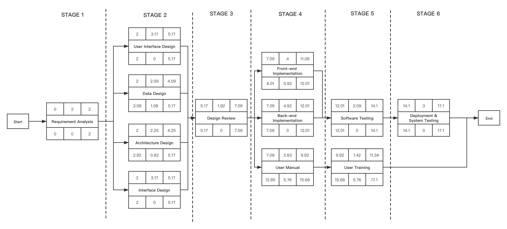
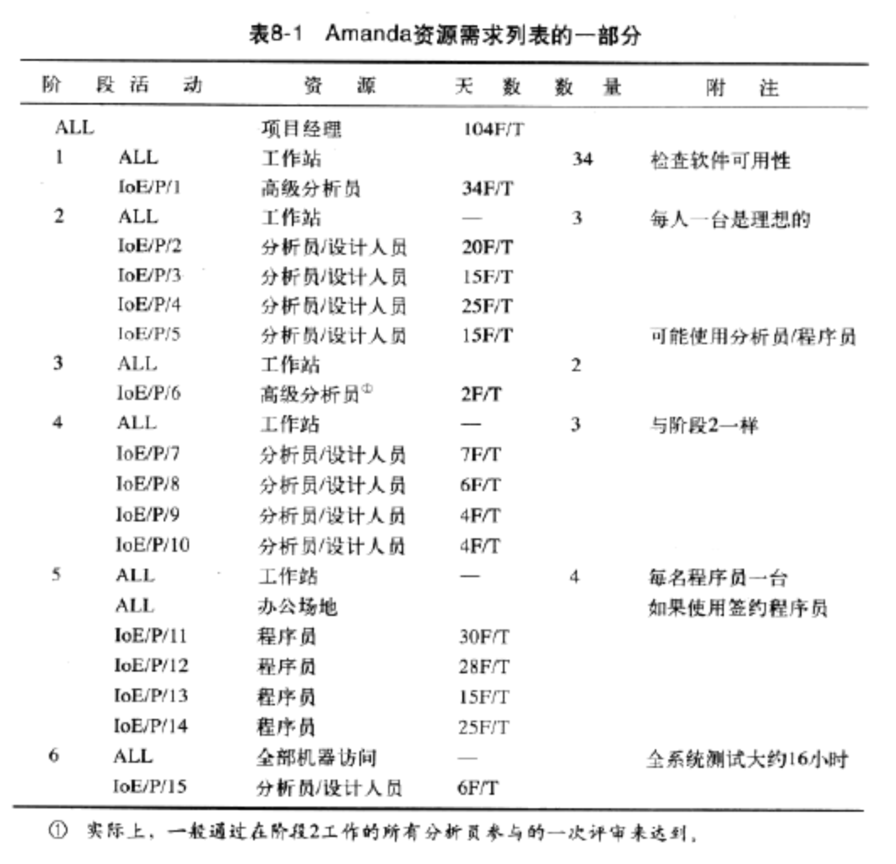
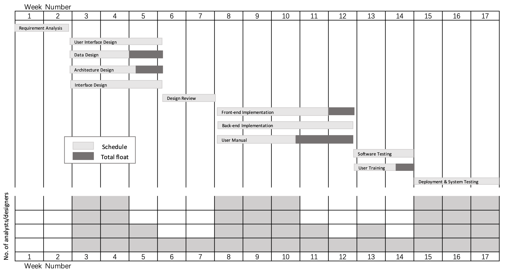
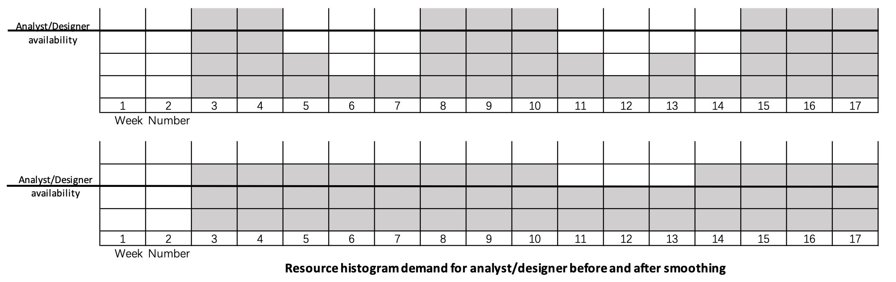
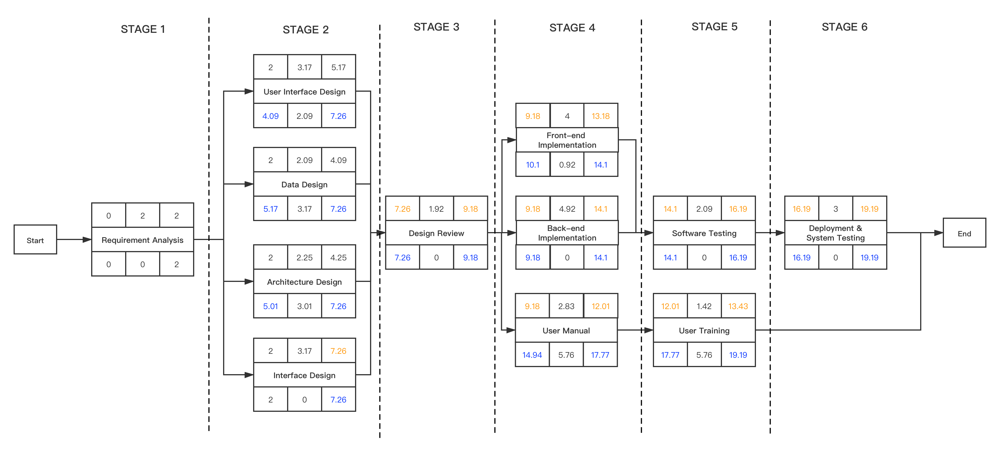
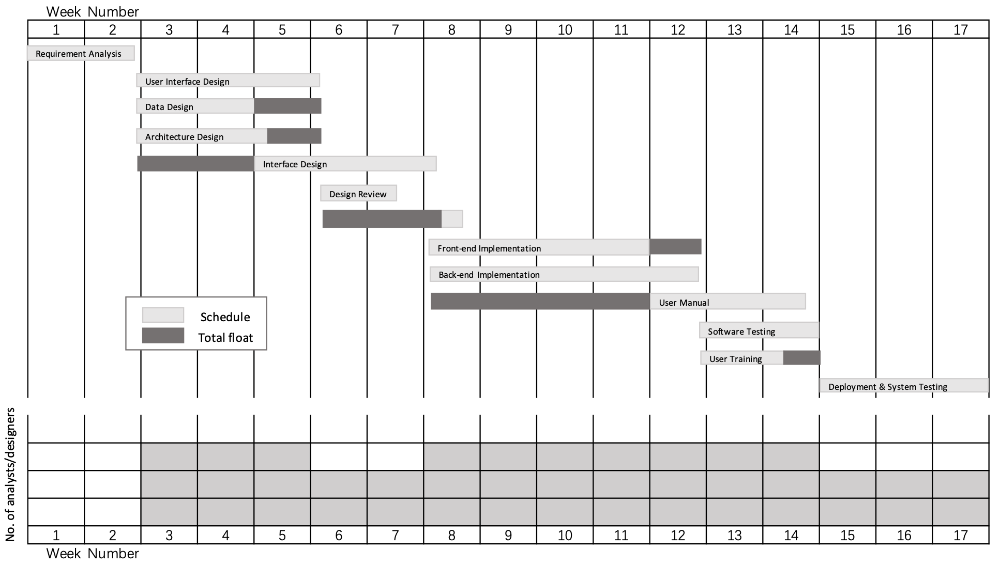

## Resource Allocation

##### Table of Contents

* [Identifying Resource Requirements](#identifying-resource-requirements)
* [Scheduling Resources](#scheduling-resources)

------

### Identifying Resource Requirements

We use **activity network analysis techniques** to plan when activities should take place in **3.3.2**. Thie was calculated as a time span during which an activity should take place - bounded by the earliest start and latest finish dates. We also use **PERT technique** in **4.7.1** to forecast a range of expected dates by which activities would be completed. And after further consideration, we match the activity plan to available resources and assess the efficacy of changing the plan to fit the resources in some aspects. 

The allocation of resources to activities will lead us to review and modify the ideal activity plan. And we revise state and project completion dates after resource allocation.

Firstly, we product a resource allocation plan to list the resources that will be required along with the expected level of demand. Some of them should considering each activity in turn and identifying the resources required, and there will also be resources required that are not activity specific, but are part of the project's infrastructure or required to support other resources. The **table of identified resource requirements** are shown below:

| Category  | Specification                                                | Qualitative/Quantitative                                     |
| --------- | ------------------------------------------------------------ | ------------------------------------------------------------ |
| Labour    | The main items in this category will be members of the development project team such as the project manager, systems analysts and software developers. Equally important will be the quality assurance team and orhter support staff and any employees of the client organization who might be required to undertake to participate in specific activities. | - PM - Requirment Analyst - Product Architext - PD Manager & PD - UI Designer - Technical Manager - Team Leaser - Development Engineer - QA - Administrators |
| Equipment | Obvious items will include workstations and other computing and office equipment. Also basic equipment such as desks and chairs are also should be considered. | - Laptop * n - Work table * n - Work chairs * n  - Display * n - A number of hard disks |
| Materials | Items that are consumed, rather than equipment that is used. They are of little consequence in most software projects but can be important for some software that is to be widely distributed. | - floppy disk (our project don't need)                       |
| Space     | For projects that are undertaken with existing staff, space is normally readily available. | - most time work online, need a basic meeting room           |
| Services  | Procurement of specialist services - development of a wide area distributed system. | - some specific lnowledge about entity game manufactures     |
| Time      | The resource that is being offset against the other primary resources - project timescales ca sometimes be reduced by increasing other resources and will almost certainly be extended if they are unexpectedly reduced. | - according to schdual is about 17weeks, a floating number   |
| Money     | Secondary resource - it is used to buy other resources and will be consumed as other resources are used. It is similar to other resources in that it is available at a cost - in this case interest charges. | - money for employee people - money for purchase equipment and material - mony to rent space |

The stage of our ICE project is shown below:

**Resource Requirement List**(mainly take Labour into consideration)

> 下面这个表参考这个图
>
> 主义Time和Activity每行的对应
>
> 

| Stage | Activities                                                   | Reources                                                     | Time                                                     | Amount | Appendix                                 |
| ----- | ------------------------------------------------------------ | ------------------------------------------------------------ | -------------------------------------------------------- | ------ | ---------------------------------------- |
| 1     | ALL Requirement Analysis                                | PM Workstation Senior analyst                      | 104F/T                                                   | 34     | Check software availability              |
| 2     | ALL User Interface Design Data Design Architecture Design Interface Design | WorkStation Analyst/Designer Analyst/Designer Analyst/Designer | 34F/T — 20F/T 15F/T 25F/T 15F/T | 3      | One per person is ideal                  |
| 3     | ALL Design Review                                       | Workstation Senior analyst                              |  2F/T                                               | 2      | May use Analyst/Designer                 |
| 4     | ALL Font-end Implementation Back-end Implementation User Manual | WorkStation Analyst/Designer Analyst/Designer Analyst/Designer | 2F/T — 7F/T 6F/T 4F/T 4F/T      | 3      | The same as Stage 2                      |
| 5     | ALL Software Testing User Training                 | WorkStation Office place Programmer Programmer Programmer | —  30F/T 28F/T 15F/T 25F/T      | 4      | One per programmer                       |
| 6     | ALL Deployment & System Testing                         | Full collection access Analyst/Designer                 | — 6F/T                                              |        | The full system test took about 20 hours |

### Scheduling Resources

- **activity schedule**: The activity schedule indicates the planned start and completion dates for each activity.
- **resource schedule**: The resource schedule shows the dates on which each resource will be required and the level of that requirement.
- **cost schedule**: The cost schedule shows the planned cumulative expenditure incurred by the use of resources over time.

Secondly, map the resource requirements produced in the first step on to the activity plan to assess the distribution of resources over the duration of the project. 

Using **Bar Chart** to produce a **resource histogram** for resource(mainly take Labour into consideration)

Each activity has been scheduled to start at its earliest start date - a sensible initial strategy, and we also wish to save any float to allow for contingencies. Earliest start date scheduling frequently creates resource histograms that start with a peak and then tail off.

By adjusting the start date of some activities and splitting other, our resource histogram can, subject to constraints such as precedence requirement, be smoothed to contain resource demand at available levels. So we smooth the resource histogram demand of analyst/designer ideally, update **smoothing resource histogram chart** is shown below:

But we dont't take resource conflict into conversation, therefore, we should prioritize activities so that resources can be allocated to competing activities in some ration order. The priority must almost always be to allocate resources to critical path activities and the to those activities that are most likely to affect others. In that way, lower-priority activirties are made to fit around the more critical, alread scheduled activities.

We use both **Total float priority** to smallest float has the highest priority and **Ordered list priority** according to the criteria. 

- **Total float priority**: ordered according to the total float, those with the smallest total float having the highest priority. In the simplest application of this method, activities are allocated resources in ascending order of total float. However, as scheduling proceeds, activities will be delayed and total floats will be reduced. It is therefore desirable to recalculate floats each time an activity is delayed.
- **Ordered list priority**: activities that can proceed at the same time are ordered according to a set of simple criteria.
  - shortest critical activity
  - critical activities
  - shorest non-critical activity
  - non-critical activity with least float
  - non-critical activities

**Project cycle Activity Network Diagram under Total float priority and Ordered list priority** is shown below:

**Bar Chart**  and **resource histogram** for resource under labour resource constraint are shown below:

