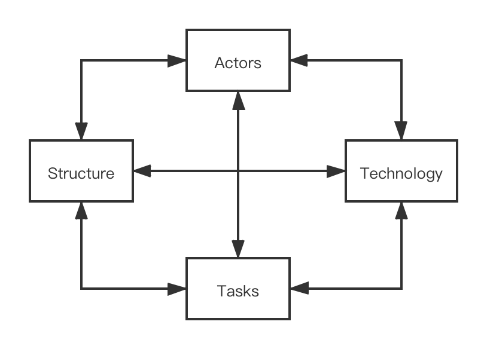

# Risk Management

##### Table of Contents

* [Risk Management Plan](#risk-management-plan)
* [Categories of Risk](#categories-of-risk)
* [Risk Identification](#risk-identification)
* [Risk Analysis, Assessment and Prioritization](#risk-analysis-assessment-and-prioritization)
* [Risk Prevention](#risk-prevention)
* [Risk Actions](#risk-actions)
* [Risk Evaluation](#risk-evaluation)
   * [PERT Activities Schedule](#pert-activities-schedule)
   * [Project Cycle Activities Network Diagram](#project-cycle-activities-network-diagram)

------

## Risk Management Plan

According to [Project Management Institute](https://www.pmi.org/)(**PMI**) risk management steps, our group make risk management plan firstly.  And then we identify risks from 4 parts, qualitative risk analysis, quantitative risk analysis. Every effort will be made to proactively identify risks ahead of time in order to implement a mitigation strategy from the project's onset.

We manage risks according to priorities, the most likely and highest impact risks are added to the project schedule to ensure that the assigned risk manager take the necessary steps to implement the mitigation response at the appropriate time during the schedule.

Upon the completion of the project, during the closing process, the project manager will analysis each risk as well as the risk management process. Based on this analusis, the project manager will identify any improvements that could be made to the risk management process for future projects.

## Categories of Risk

Project risks are those that could prevent the achievement of the objectives given to the project manager & team. 

In the Software Project and Process Management Course Project **“Online Entity Game Store —— ICE”**, we reference to "Lyytinen-Mathiassen-Ropponen" risk framework and we divided the risk factors into four parts.

- **Actors**:  main participants are the members of the group, among which the typical risks are mention below
  -  changing of the staff
  - poor communication within the team leads to loss of valuable information of the project
- **Technology**: technology is the specific knowledge and tools using in the project, typical risk are mention below
  - tools used in the project development and implementation do not meet the project requirements
  - technology used in the project has defects, such as it is not suitable for the project or the team members are not familiar with the technology
- **Structure**: structure contains the planning structure, project structure, management structure and so on, typical risk are mention below
  - project management structure is not clear, which leads to the delay of each team member's timely positioning of their own work
- **Tasks**: tasks involving specific activities of the project, typical risk are mention below
  -  risk of requirement change
  - complexity of integration among various project components will delay the progress of the project, 
  - quality and performance risk of the ICE system;

## Risk Identification

In the risk identification of this project, we adopted the risk identification method combining **Checklist method** and **Brainstorming method**, referred to checklists models such as **lyytinen model** and **Barry Boehm model**, and established our own checklists as follows:

| Serial Number | Risk                                               | Risk reduction techniques                                    |
| ------------- | -------------------------------------------------- | ------------------------------------------------------------ |
| R1            | Team members did not communicate well              | Agree on the way of communication;  Regular communication of work progress;  The minutes of the meeting |
| R2            | Technology adopted is flawed                       | Use familiar technology;  Specially-assigned person to study the new technology needed |
| R3            | Project management structure is not clear          | Formulate the management structure;  Special personnel to maintain the management structure |
| R4            | Code integration issues                            | Convention code specification;  Incremental development and integration |
| R5            | Personnel changes                                  | More than one person participated in the core work of the project in order to familiar with the project process |
| R6            | Implementation tools do not meet the requirements  | Early implementation of the sources of tools;  Look for alternative tools |
| R7            | Change to requirements specification during coding | Stringent change control procedures High change threshold Incremental development(deferring changes) Agree on the requirement change control process in writing and record the change request |
| R8            | System quality and performance risks               | More exchange of work results;  Inspection and review;  Using performance test |

## Risk Analysis, Assessment and Prioritization

In this project, we define the risk probability using score from 1 to 10, and we divide them into 4 levels from extra-high to extra-low. **Risk Probability Level Table**, **Risk Impact Level Table**, and **Risk Level Decision Table**  are shown below:

After defining the levels, we analyzed the potential risks in the project from the four aspects mentioned above.

We simulate the risk exposure during our brainstorming, and we use **Barry Boehm's method** for risk exposure assessment. And we use **risk exposure formula** for calculating.
$$
\text{risk exposure} = \text{potential damage} \times \text{probability of occurrence}
$$

| Ref  | Hazard                                             | Likelihood | Impact | Risk |
| ---- | -------------------------------------------------- | ---------- | ------ | ---- |
| R1   | Team members did not communicate well              | 5          | 5      | 25   |
| R2   | Technology adopted is flawed                       | 3          | 10     | 30   |
| R3   | Project management structure is not clear          | 3          | 4      | 12   |
| R4   | Code integration issues                            | 4          | 5      | 20   |
| R5   | Personnel changes                                  | 2          | 8      | 16   |
| R6   | Implementation tools do not meet the requirements  | 2          | 4      | 8    |
| R7   | Change to requirements specification during coding | 8          | 8      | 64   |
| R8   | System quality and performance risks               | 6          | 7      | 42   |

And the **probability impact matrix** is as follow:

## Risk Prevention

1. **For risk R1**, the group shall agree on the communication method at the beginning of the project and regularly communicate the schedule of work progress. If necessary, the meeting minutes shall be taken to minimize the possibility of risk R1.
2. **For risk R2**, when encountering a risk bottleneck, turn the head and select experienced or familiar technologies. At the same time, a team member can be allowed to study and learn new technologies to pave the way for the implementation of the project.
3. **For risk R3**, formulate the management structure in advance, and let a team member manage and maintain the management structure; 
4. **For risk R4**, to start the project code writing, agree on the development environment and code specification, annotation specification, etc., in the development process, incremental development and intergration to reduce the final workload;
5.  **For risk R5**, everyone is involved in the core work of the project to ensure that the change of personnel will not make the project unable to proceed normally; 
6. **For risk R6**, identify and implement the source of the tools at the beginning of the project, find the necessary alternative tools, and implement the tools in place before the tools need to be used;
7. **For risk R7**, at the beginning of the project construction, agree on the requirement change control process with the user, record and archive the user's requirement change application; 
8. **For risk R8**, in the regular meeting of the team, the work results are exchanged, the results are checked and reviewed, and the performance test is carried out. After the performance test meets the indicators, the follow-up work is carried out.

## Risk Actions

According to the formula of **Risk reduction leverage(RRL)**
$$
\text{RRL} = (RE_{before} - RE_{after}) / \text{cost of risk reduction}
$$
And we picked out and examined what appear to be the most threatening risks to the project, creating and maintaining our findings in a **Risk Register**.

## Risk Evaluation

We use **PERT(Program Evaluation and Review Technique)** for risk evaluation. PERT was developed to deal with the uncertainly surrounding estimates of task durations.

First we divided the global task into sub-task, and estimating for three times, **Most likely time(a)**, **Optimistic time(m)** and **Pessimistic time(b)**, then using formula to calculating **Expected Duration** and **Activity Standard Deviations**
$$
t_e = \frac{a + 4m + b}{6} \\
s = \frac{b - a}{6}
$$

### PERT Activities Schedule

### Project Cycle Activities Network Diagram

